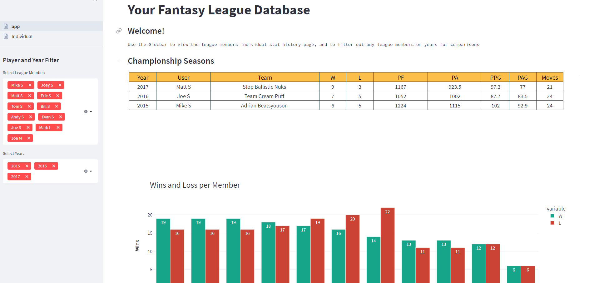
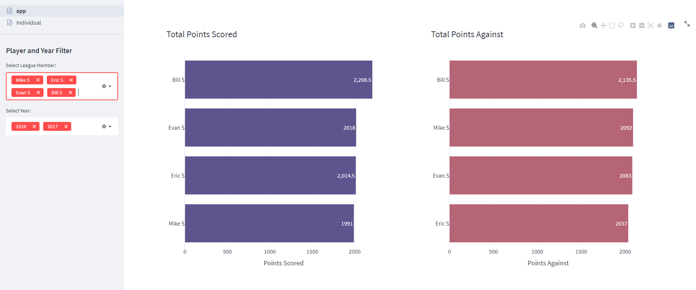
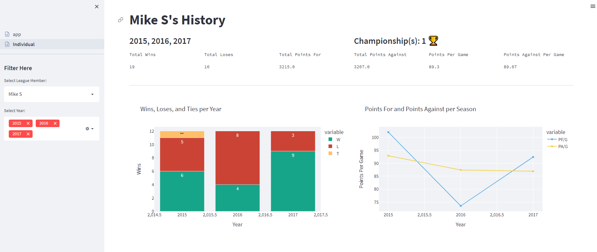
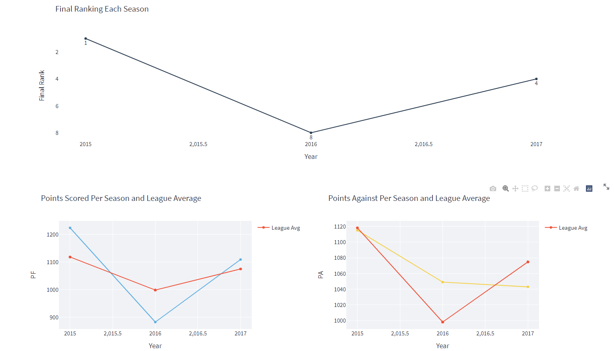
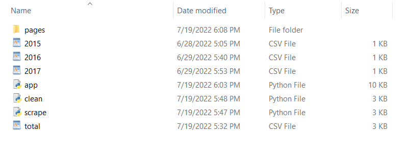

# ESPN Fantasy Football League History Database App

Create a dynamic Streamlit dashboard to view the fantasy football stats accumulated over 
multiple seasons of your personal league with this app. Selenium and Beautiful Soup will    
facilitate the web scarping and download of the seasonal stats into CSV form.  Finally, Plotly
provides customizable charts for player perfromance comparisons.


## Authors

- [@WheyGood (Matt S)](https://www.https://github.com/WheyGood)


## Acknowledgements
 - [Streamlit](https://docs.streamlit.io/)
 - [Readme Editor Tool](https://readme.so/)


## App Example


### Individual player page




## Tech Stack

**Language:** Python 3.9.4

**Packages:** 
- Pandas 1.2.5 
- NumPy 1.21.0 
- Selenium 4.3.0
- BeautifulSoup 4.11.1
- Streamlit 1.10.0
- Plotly 5.9.0
- re

**Additional:** 

Google Chrome and Chrome Web Driver for your current browser.  
Find your Version in About Google Chrome Section of Settings

Download link -> https://sites.google.com/chromium.org/driver/downloads
## Deployment

First step is to make sure the chrome web driver you have installed (see tech stack section for the link)
is placed in the Program Files (x86) of your machine. 

Place all files in a single folder and copy the path of the folder

**First**, run the the scrape file. Run this as many times as you have seasons

 ```
cd folder_path
python scrape.py
 ```

**Second**, after all the seasonal stat csv files are downlaoded and in the folder 

```
cd folder_path
python clean.py
```

**Finally**, make sure you are in the directory and your folder looks like this



```
cd folder_path
streamlit run app.py
```

## Beginner Installation (no python on cpu)

If you stumbled on this repo and you do not have python installed on your windows machine then
please view this tutorial in order to install python/pip, selenium and the required packages.

- [Install Python and pip on your Windows PC](https://www.youtube.com/watch?v=AwIXfaGEN4c)

- [Downloading Chrome Web Driver Yotube video example](https://youtu.be/Xjv1sY630Uc?t=261)


Need to use the pip command in the command prompt to install all of the required packages.
Google 'pip install package' to best find the command to complete this task.


This site is an example for how to install our first package of pandas 
https://pypi.org/project/pandas/ 

Full List of pip commands needed
```
pip install pandas
pip install numpy
pip install selenium
pip install beautifulsoup4
pip install streamlit
pip install plotly
```

Finally after all of this the progrmas should run nicely!
